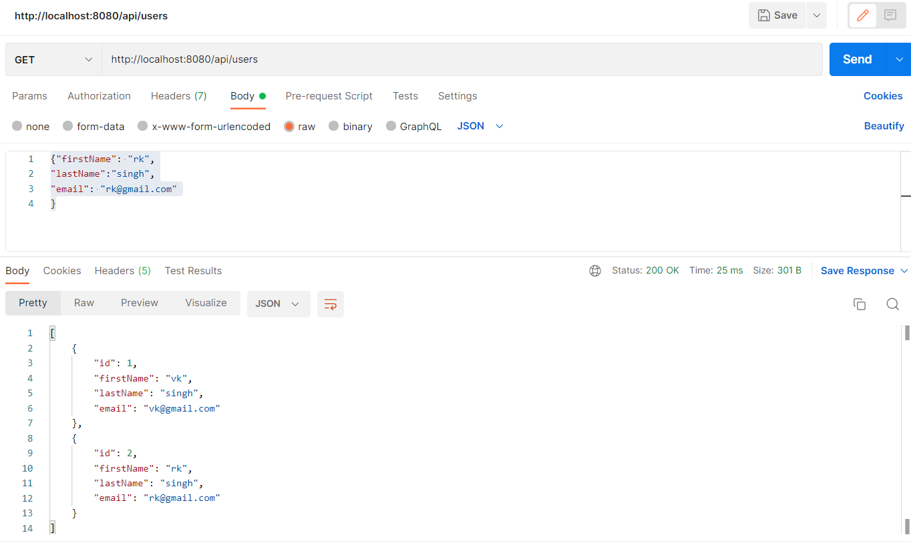
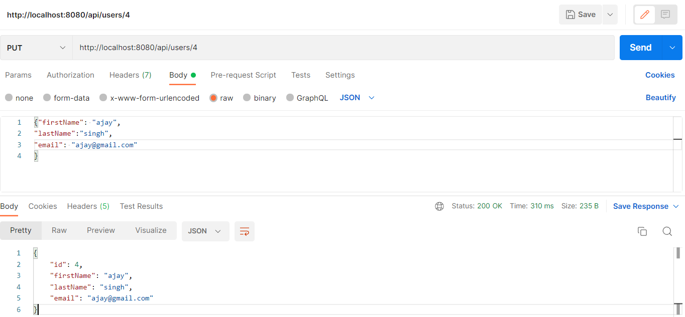

## Test Spring Boot CRUD REST APIs using Postman Client
### Create User REST API:

http://localhost:8080/api/users

### Get All Users REST API:
http://localhost:8080/api/users

### Get Single User REST API:
http://localhost:8080/api/users/1

### Update User REST API:
(OR)
User existingUser = userRepository.findById(user.getId()).get();
existingUser.setFirstName(user.getFirstName());
existingUser.setLastName(user.getLastName());
existingUser.setEmail(user.getEmail());
User updatedUser = userRepository.save(existingUser);
return updatedUser;

http://localhost:8080/api/users/4

